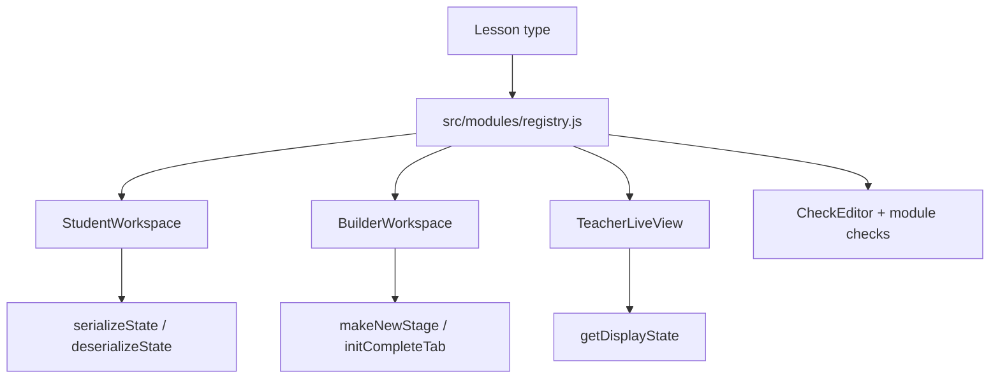

# Lesson Type Modules

Lesson types are intentionally isolated behind `src/modules/registry.js`. The classroom, teacher view, and builder should ask the registry for behavior instead of branching directly on every lesson type.

## Design Intent

The module boundary keeps new lesson types from spreading changes through `LessonTaskContent.jsx`, `TaskEditor.jsx`, and teacher live-view code. A type owns its state shape, editor surfaces, check editor, display-state selection, sandbox defaults, and optional runtime bridge.

Core app code may branch for broad task classes such as quiz or information tasks, but code lesson behavior should live in `src/modules/<type>/`.

## Contract

Each `src/modules/<type>/index.js` exports a default object. The complete inventory is mirrored in `docs/CODEBASE_MAP.md`; this page explains the intent behind the fields.

Required identity and surfaces:

- `type` matches the lesson `type` value.
- `StudentWorkspace` renders the student-facing task surface.
- `BuilderWorkspace` renders the builder task editor surface.
- `CheckEditor` renders the check configuration UI.
- `TeacherLiveView` renders the teacher-side live/sandbox view, or is `null` if the student workspace can be reused read-only.

State and display hooks:

- `initialState(task)` creates the student state for a task.
- `defaultState` is the fallback when no task-specific state exists.
- `serializeState(state)` and `deserializeState(raw)` protect localStorage and RTDB from type-specific state details.
- `getDisplayState(task, stage, liveState, tab)` chooses what teachers see for starter, stage, complete, sandbox, and live states.
- `getSandboxState(lesson, task)` creates the initial personal or teacher sandbox state.

Builder hooks:

- `makeCodeTaskFields(task)` creates type-specific fields when a task becomes a code task.
- `makeNewStage(task, existing)` creates a new stage state.
- `initCompleteTab(task, ctx)` and `initStageTab(stage, ctx)` lazily populate builder tabs.
- `getCarryThroughUpdates(sourceTask)` and `getNewStarterUpdates(task)` keep carry-through logic type-owned.

Capability flags:

- `supportsInteractionMode` controls Run/Submit mode UI.
- `supportsIncorrectChecks` controls feedback-check UI.
- `supportsTests` and `supportsVariableChecks` control Python-style test/variable checks.
- `supportsDomChecks` controls HTML element checks.
- `runtime` exposes optional async execution helpers such as Pyodide or MicroPython.

## Runtime Flow

## Usually Changes With

When this contract changes, also check:

- `src/modules/__tests__/moduleInterface.test.js`
- `src/app/components/LessonTaskContent.jsx`
- `src/app/views/teacher/TeacherEditorPanel.jsx`
- `src/builder/components/TaskEditor.jsx`
- `src/builder/components/task-editor/TaskOptionsSection.jsx`
- `docs/architecture/feature-impact-map.md`
- `docs/authoring/<type>.md`
- `docs/CODEBASE_MAP.md`
- `docs/TESTING.md`

## Adding A New Type

1. Add `src/modules/<type>/index.js`, `StudentWorkspace.jsx`, `BuilderWorkspace.jsx`, and `CheckEditor.jsx`.
2. Add type-specific `checks.js` if the type needs custom checks.
3. Register the module in `src/modules/registry.js`.
4. Add authoring documentation and examples.
5. Add module contract tests and focused behavior tests.
6. Update `docs/CODEBASE_MAP.md`, `docs/FEATURES.md`, and this page if the contract changes.

