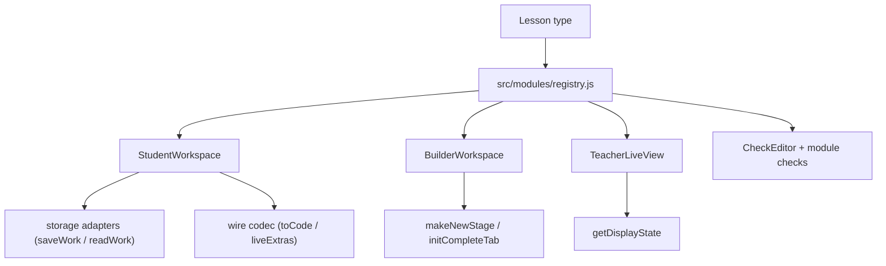

# Lesson Type Modules

Lesson types are intentionally isolated behind `src/modules/registry.js`. The classroom, teacher view, and builder should ask the registry for behavior instead of branching directly on every lesson type.

## Design Intent

The module boundary keeps new lesson types from spreading changes through `LessonTaskContent.jsx`, `TaskEditor.jsx`, and teacher live-view code. A type owns its state shape, editor surfaces, check editor, display-state selection, sandbox defaults, and optional runtime bridge.

Core app code may branch for broad task classes such as quiz or information tasks, but code lesson behavior should live in `src/modules/<type>/`.

## Contract

Each `src/modules/<type>/index.js` exports a default object. The complete inventory is mirrored in `docs/CODEBASE_MAP.md`; this page explains the intent behind the fields.

Each module is split in two (modular activities plan, step 1.1):

- `definition.js` is pure and Node-ESM-safe: no JSX, React, DOM access or runtimes (Pyodide, Blockly), and explicit `.js` extensions on every relative import. It holds `type`, `meta`, `capabilities`, the authoring, carry-through, state, sandbox and display hooks, and the capability flags, wrapped in `defineModule()` (`src/modules/defineModule.js`), which throws on a missing required field.
- `index.js` adds the UI half with `defineUiModule(definition, { StudentWorkspace, BuilderWorkspace, CheckEditor, FeedbackCheckEditor?, TeacherLiveView, getLayoutStyles, runtime })`. The merged object has the same shape the app consumed before the split.

`src/modules/definitions.js` collects every definition (`MODULE_TYPES`, `getModuleDefinition`) so the CLI, validation and shared type lists (`LESSON_MODULE_TYPES` in `src/shared/composedLesson.js`) can read module metadata under plain Node without importing React. `registry.js` takes its order and labels from it. `moduleDefinitionsNode.test.js` loads every definition in a real Node process to keep the split honest.

### Metadata and capabilities (plan step 1.2)

Core code no longer keeps its own module-type lists or label/icon maps; it derives them from the definitions with `getModuleTypesWhere`, `getModuleTypesWithCapability`, `CARRY_THROUGH_FIELDS` and `getModuleLabel(type, surface)` (all in `definitions.js`). A new module declares these once, and `defineModule` rejects a definition that omits one. `derivedTypeLists.test.js` pins the derived values.

`meta`:

- `label` — canonical name (registry, admin lists, playground title, Builder "Create a lesson" copy); `order` — registry order.
- `shortLabel`, `icon`, `pickerHint` — the Builder's composed-lesson module picker (`TaskEditor.jsx`).
- `language` — `'python' | 'html' | null`, the module's code language.
- `playground` — has a `/playground/:type` route (`PLAYGROUND_LESSON_TYPES`).
- `surfaceLabels` (optional) — per-surface wording that differs from `label`: `lessonIntro` (InformationTask Introduction slide), `builderMeta` (LessonMetaPanel), `print` (printLesson), `stageReference` (SupportStagePanel kicker).

`capabilities`:

- `sideExplainer` — explainer renders as a side rail (`LessonTaskContent.jsx`); otherwise an accordion above the workspace.
- `modulePanes` — `StudentWorkspace` reports `visiblePanes` through the generic `modulePanes` state.
- `teacherLiveReference` — teacher live code can be the support-stage reference (`TEACHER_LIVE_REFERENCE_TYPES`); membership alone is not enough, `teacherLiveReferenceDisplayState` must also adapt the payload.
- `unifiedStages` — remote reset uses the unified Starter/Complete stage selector (`buildStageOptions`).
- `sandboxState` — `'code' | 'blocks' | 'fs' | 'desktop' | 'files'`, where TeacherView keeps teacher sandbox work (`'code'` = the single code-string slot).

Top-level fields added alongside: `completeField` (the legacy non-stage Complete field, e.g. `completeCode`; an array field counts when non-empty) with `stageLabels` for stage options, and `explainerCodeBlockLanguages` (the explainer editor's code-block menu; empty = a generic block) next to `explainerInlineCodeLanguages`.

Required identity and surfaces:

- `type` matches the lesson `type` value.
- `StudentWorkspace` renders the student-facing task surface.
- `BuilderWorkspace` renders the builder task editor surface.
- `CheckEditor` renders the check configuration UI.
- `TeacherLiveView` renders the teacher-side live/sandbox view, or is `null` if the student workspace can be reused read-only.

State and display hooks:

- `initialState(task)` creates the student state for a task.
- `defaultState` is the fallback when no task-specific state exists.
- `serializeState(state)` and `deserializeState(raw)` protect localStorage and RTDB from type-specific state details.
- `getDisplayState(task, stage, liveState, tab)` chooses what teachers see for starter, stage, complete, sandbox, and live states.
- `getSandboxState(lesson, task)` creates the initial personal or teacher sandbox state. Since contract v2 it is an alias `defineModule` sets from `lifecycle.sandboxStarter`; definitions declare only the latter.

### Contract v2: lifecycle, storage, wire (plan steps 4.1–4.2)

Three required, frozen hook groups on every definition, validated by `defineModule` (`LIFECYCLE_HOOKS`, `STORAGE_HOOKS`, `WIRE_HOOKS`). The shared builders live in `src/modules/moduleContract.js` (pure). They reproduce today's behaviour exactly; `src/modules/__tests__/moduleContract.test.js` compares them against verbatim copies of the inline branches they replaced, and the Phase 0 `useStudentCodeState.*` characterisation suites pin the resulting localStorage/RTDB bytes.

`lifecycle` — what a task or lesson means for the module's work:

- `resetTarget(task, action, ctx)` — the state a teacher remote reset (`starter`, `complete`, `stage_<n>`) puts in front of the student, in the module's own shape (`{ code }`, `{ files, entryFile }`, `{ blocks, stageIndex }`, `{ fs }`, `{ desktop }`, `{ circuit }`); `ctx` carries the fallbacks (`fs`, `circuit`, `desktop`). `resolveRemoteResetTarget` in `src/app/studentTaskContent.js` is now a dispatcher over this hook.
- `hasComplete(task)` — whether a complete solution exists to offer the student (StudentView `hasCompleteSolution`; a non-module type keeps HTML's files rule).
- `teacherCompleteTab(task)` — whether TeacherEditorPanel shows a separate Complete tab (`false` for python, html, arcade and turtle, whose complete lives in the unified code stages).
- `sandboxStarter(lesson, task)` — the teacher sandbox starter (TeacherView). `getSandboxState` is its alias.
- `composedSandboxFields(firstTask)` — the lesson-level sandbox fields (`sandboxStarter`, `sandboxStarterFiles`, `sandboxStarterFs`, `sandboxStarterDesktop`, `sandboxStarterCircuit`) a composed lesson's module derives from its first code task in `getEffectiveLessonForModule`. Turtle returns `{}`, as before.

`storage` — how the module's work maps onto the localStorage record shapes in `docs/agents/runtime-model.md` (which must not change):

- `layout: 'record'` (one `headstart_{lessonId}_{taskId}_{anonymousId}` record) built with `recordStorage({ workKey, taskMeta, sandboxMeta })`: python/turtle `{ code, output, runStatus }`, arcade adds `arcadeDesign` (task and sandbox), electronics `{ code }`, scratch `{ state }`, filesystem `{ fs }`, desktop `{ desktop }`. Meta fields are written only when passed, in declared order.
- `layout: 'perFile'` (one `…_{filename}_{anonymousId}` record per file) built with `perFileStorage()`: html `{ content }`.
- `toTaskRecord(work, meta)` / `fromTaskRecord(record)` and `toSandboxRecord` / `fromSandboxRecord`; the readers return `{ work, meta }` (meta holds only fields the record had) or null.

`createStudentPersistence` exposes the adapter-driven `saveWork(type, actorId, taskId, work, meta)`, `readWork(type, actorId, taskId, { filename })`, `saveSandboxWork(type, actorId, work, meta)` and `readSandboxWork(type, actorId, { filename })`, routed exactly like the named savers (personal sandbox, in-memory store in presentation/preview, else localStorage). The named per-type functions (`savePythonCode`, `saveScratch`, …) remain for existing callers until `useStudentCodeState` moves to a generic work slot (step 4.3); both share one `routeSave`. `createStudentPersistence.work.test.js` proves the generic calls write the same keys and bytes.

`wire` — how the work travels over Realtime Database:

- `sandboxChannel` — `'code'` (`sandboxCode` / `currentCode` string) or `'files'` (html; must match `capabilities.sandboxState === 'files'`).
- `toCode(work)` / `fromCode(code)` — identity for code-string modules (`codeStringWire`), `JSON.stringify` / tolerant parse for scratch, filesystem and desktop (`jsonWire`); html returns null (`filesWire`, which also offers `toFilesMap`). Callers keep their own null handling (e.g. Scratch's `{}` for an empty sandbox).
- `liveExtras({ arcadeDesign, turtleResult })` — always returns both teacherLive extras, explicit `null` for the ones the module lacks (teacherLive is an `update()` merge). Arcade passes its design; Turtle compacts its result with `compactTurtleResultForSync`.
- `submission(work)` — the value logged with an attempt (the work itself; html a filename → content map).

Call sites using the hooks today: `studentTaskContent.resolveRemoteResetTarget`, `StudentView` (`hasCompleteSolution`), `TeacherEditorPanel` (Complete tab), `TeacherView` (`lifecycle.sandboxStarter`), `composedLesson.getEffectiveLessonForModule`, `useTeacherLivePublish` (live extras and the work-slot code string), and `sharedWorkspacePayload` (snapshot code/arcade design and share copy, keyed by `capabilities.sandboxState`). The remaining `useStudentCodeState` per-type slots and TeacherView's sandbox branches move in steps 4.4–4.6.

### Contract v2: checking and the generic work slot (plan step 4.3)

Two optional groups put a module on `useStudentCodeState`'s generic work slot. A module declares both or neither (`defineModule` rejects one without the other; absent groups are `null`), and the slot needs a `'record'` storage layout and the `'code'` wire channel. Filesystem and desktop are on it; python, turtle, arcade and electronics follow in step 4.4, html and scratch in 4.5.

`checking` — when and how the task check runs against the work:

- `trigger` — `'change'` (every edit and every workspace interaction; filesystem, desktop), `'run'`, `'submit'` or `'workspace'` (the workspace evaluates and reports its own checks). Only `'change'` is wired so far.
- `buildContext(work, interaction)` — the context handed to the check evaluators: filesystem `{ fs, ...interaction }`, desktop `{ fs: desktop.fs, desktop, ...interaction, input }` (`input` is the in-memory input summary the Desktop workspace sends on its interaction for the `input_*` checks; `null` when none).

`workSlot` — where the work comes from, for the generic loaders:

- `starterField`, `sandboxField`, `stageField` — the task, lesson and code-stage fields holding starting work (`starterFs` / `sandboxStarterFs` / `fs`; `starterDesktop` / `sandboxStarterDesktop` / `desktop`). The complete value is the module's `completeField`; carry-through uses `carryThroughField`.
- `empty(task)` — the fallback when a field is missing (`DEFAULT_FS`; `makeDefaultDesktop(task?.availableApps)`).
- `normalise(work)` — applied whenever work is restored (task load, remote reset, show stage, show complete, personal sandbox, teacher sandbox push), never to the student's own edits (identity for filesystem, `normaliseDesktop` for desktop).

In `useStudentCodeState` the slot is one `work` state, `{ moduleType, taskId, value }`, plus an `interactions` map keyed by module type (`{ currentDir, openFile }`; a carrying task keeps the previous directory). `workRef` / `interactionsRef` are updated synchronously on every set, so a handler that runs straight after another in the same event reads what was just set. Readers go through `workValueFor(moduleType)`, which returns the module's stable default when the slot holds another module's work, so a composed lesson switching modules never publishes, saves, mirrors or shares a leftover value. One pipeline replaces the per-module handlers:

- `handleWorkChange(next, { moduleType, interaction, suppressFailFeedback })` — set work (and/or interaction) → `persistence.saveWork` → teacherLive (published by `useTeacherLivePublish`'s effect, which tracks the work value) → checking per `checking.trigger` → idle feedback. An interaction-only call (`next` undefined) re-checks with fail feedback suppressed.
- `evaluateAndReport({ moduleType, work, context }, { suppressFailFeedback })` — evaluates the task check, applies local feedback, and in a live lesson outside the personal sandbox writes the run (`code` = `wire.toCode(work)`) and, while unsolved, the attempt (`wire.submission(work)`).

Loading (own save, carry, starter), `saveCurrentWork`, the personal sandbox, remote reset, show stage / complete, watch-start writes, the teacherLive payload and the share snapshot all read the definition instead of branching on the type. `cs.work`, `cs.handleWorkChange` and `cs.readSavedTaskWork(moduleType, taskId)` are exposed; the per-module names the workspaces use (`fsState`, `desktopState`, `fsInteraction`, `desktopInteraction`, `handleFsChange`, `handleDesktopChange`, `handleFsInteraction`, `handleDesktopInteraction`, `readSavedTaskFs`, `readSavedTaskDesktop`) remain as thin aliases, as do `useSandboxCodePush`'s and `buildSharedWorkspaceSnapshot`'s per-kind parameters until step 4.6.

Builder hooks:

- `makeCodeTaskFields(task)` creates type-specific fields when a task becomes a code task.
- `makeNewStage(task, existing)` creates a new stage state.
- `initCompleteTab(task, ctx)` and `initStageTab(stage, ctx)` lazily populate builder tabs.
- `getCarryThroughUpdates(sourceTask)` and `getNewStarterUpdates(task)` keep carry-through logic type-owned.

Validation hooks (pure; shared by the Builder and the CLI through `src/shared/lessonValidation.js`):

- `validateTask(task, { n, lesson, errors, warnings })` pushes the module's own rules (check fields, starter state, stages, complete-solution warnings). It runs for code tasks and for `code_arrange` tasks hosted by the module, looked up by the task's effective module type.
- `hasStarterContent(task)` (optional; `null` = no empty-editor warning), `hasCheckValue(task)` (optional; the Builder's untested-check reminder) and `validateTaskInBrowser(task, ctx)` (optional; Builder-only rules that need browser APIs).

Capability flags:

- `supportsInteractionMode` controls Run/Submit mode UI.
- `supportsIncorrectChecks` controls feedback-check UI.
- `supportsTests` and `supportsVariableChecks` control Python-style test/variable checks.
- `supportsDomChecks` controls HTML element checks.
- `runtime` exposes optional async execution helpers such as Pyodide or MicroPython.

## Runtime Flow

```mermaid
flowchart TD
  Lesson["Lesson type"] --> Registry["src/modules/registry.js"]
  Registry --> Student["StudentWorkspace"]
  Registry --> Builder["BuilderWorkspace"]
  Registry --> Teacher["TeacherLiveView"]
  Registry --> Checks["CheckEditor + module checks"]
  Student --> Persist["storage adapters (saveWork / readWork)"]
  Student --> Wire["wire codec (toCode / liveExtras)"]
  Teacher --> Display["getDisplayState"]
  Builder --> Stages["makeNewStage / initCompleteTab"]
```

## Check-Type Registry

Check evaluation is registry-driven. `src/modules/checkRegistry.js` (pure, Node-safe) exports `createCheckRegistry(defs)`; `src/modules/checks.js` builds one `checkRegistry` from `CORE_CHECKS` plus each module's exported `CHECKS` array (`filesystem`, `desktop`, `python`, `html`, `electronics`, `turtle`) and the shared input checks (`src/shared/input/checks.js`). A definition is:

`{ type, owner, subject?, operators?, fields?, aliases?, timing, requiresRun, submitAllowed, contextKey?, evaluate(check, output, ctx), validate?(check, ctx) }`

- `owner` is `core`, `module:<type>`, `input` (`input_gesture`, `input_shortcut`, `input_modifier`, evaluated against `ctx.input`), and later `activity:<id>`. Every canonical type and alias has exactly one owner; registering a duplicate id throws.
- A module that can evaluate check types owned elsewhere lists them in its definition's optional `inheritsCheckTypes` (Desktop: the `input_*` types). `lessons capabilities` lists them under the module, and `validateRegisteredChecks` passes the task's effective module as `ctx.moduleDefinition` so a type's `validate()` can reject modules that don't inherit it.
- `aliases` are legacy ids that resolve to the definition (`output_contains` → `output`, `element_value_equals` → `html_element_value`, `fs_content_contains` → `fs_file_content`). Core aliases are rewritten by `normalizeCheckShape` before lookup; module evaluators normalise their own aliases.
- `evaluateSingleCheck` normalises core aliases, looks the type up, and calls `evaluate`; unknown types return `false`. The electronics override (a generic `code` check reads the Micro Controller's MicroPython source when `ctx.circuit` is set) lives in the core `code` definition.
- `CHECK_TYPES.RUN_REQUIRED` and `SUBMIT_ALLOWED` (used by `checkRequiresRun` / `checkAllowedForSubmit`, the Builder and the CLI) are derived from `requiresRun` / `submitAllowed`, including aliases.
- Scratch checks are not registered: they are evaluated inside the Scratch workspace by `evaluateScratchCheck`.
- `validate` is reserved for per-type authoring validation (still in `src/shared/checkAuthoringValidation.js`); Builder check editors do not yet render from `fields`.

To add a check type, add a definition to the owning module's `CHECKS`. `src/modules/__tests__/checkRegistryParity.test.js` asserts ownership and parity with the frozen pre-registry dispatcher (`legacyCheckDispatcher.js`).

## Usually Changes With

When this contract changes, also check:

- `src/modules/__tests__/moduleInterface.test.js`
- `src/app/components/LessonTaskContent.jsx`
- `src/app/views/teacher/TeacherEditorPanel.jsx`
- `src/builder/components/TaskEditor.jsx`
- `src/builder/components/task-editor/TaskOptionsSection.jsx`
- `docs/architecture/feature-impact-map.md`
- `docs/authoring/<type>.md`
- `docs/CODEBASE_MAP.md`
- `docs/TESTING.md`

## Adding A New Type

1. Add `src/modules/<type>/definition.js` (including the `lifecycle`, `storage` and `wire` groups, usually from the `src/modules/moduleContract.js` builders), `index.js`, `StudentWorkspace.jsx`, `BuilderWorkspace.jsx`, and `CheckEditor.jsx`.
2. Add type-specific `checks.js` if the type needs custom checks, exporting `CHECKS` definitions and adding them to `checkRegistry` in `src/modules/checks.js`.
3. Register the definition in `src/modules/definitions.js` and the module in `src/modules/registry.js`.
4. Add authoring documentation and examples.
5. Add module contract tests and focused behavior tests.
6. Update `docs/CODEBASE_MAP.md`, `docs/FEATURES.md`, and this page if the contract changes.

