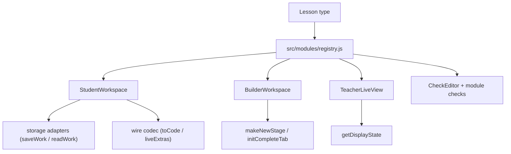

# Lesson Type Modules

Lesson types are intentionally isolated behind `src/modules/registry.js`. The classroom, teacher view, and builder should ask the registry for behavior instead of branching directly on every lesson type.

## Design Intent

The module boundary keeps new lesson types from spreading changes through `LessonTaskContent.jsx`, `TaskEditor.jsx`, and teacher live-view code. A type owns its state shape, editor surfaces, check editor, display-state selection, sandbox defaults, and optional runtime bridge.

Core app code may branch for broad task classes such as quiz or information tasks, but code lesson behavior should live in `src/modules/<type>/`.

## Contract

Each `src/modules/<type>/index.js` exports a default object. The complete inventory is mirrored in `docs/CODEBASE_MAP.md`; this page explains the intent behind the fields.

Each module is split in two (modular activities plan, step 1.1):

- `definition.js` is pure and Node-ESM-safe: no JSX, React, DOM access or runtimes (Pyodide, Blockly), and explicit `.js` extensions on every relative import. It holds `type`, `meta`, `capabilities`, the authoring, carry-through, state, sandbox and display hooks, and the capability flags, wrapped in `defineModule()` (`src/modules/defineModule.js`), which throws on a missing required field.
- `index.js` adds the UI half with `defineUiModule(definition, { StudentWorkspace, BuilderWorkspace, CheckEditor, FeedbackCheckEditor?, TeacherLiveView, getLayoutStyles, runtime })`. The merged object has the same shape the app consumed before the split.

`src/modules/definitions.js` collects every definition (`MODULE_TYPES`, `getModuleDefinition`) so the CLI, validation and shared type lists (`LESSON_MODULE_TYPES` in `src/shared/composedLesson.js`) can read module metadata under plain Node without importing React. `registry.js` takes its order and labels from it. `moduleDefinitionsNode.test.js` loads every definition in a real Node process to keep the split honest.

### Metadata and capabilities (plan step 1.2)

Core code no longer keeps its own module-type lists or label/icon maps; it derives them from the definitions with `getModuleTypesWhere`, `getModuleTypesWithCapability`, `CARRY_THROUGH_FIELDS` and `getModuleLabel(type, surface)` (all in `definitions.js`). A new module declares these once, and `defineModule` rejects a definition that omits one. `derivedTypeLists.test.js` pins the derived values.

`meta`:

- `label` — canonical name (registry, admin lists, playground title, Builder "Create a lesson" copy); `order` — registry order.
- `shortLabel`, `icon`, `pickerHint` — the Builder's composed-lesson module picker (`TaskEditor.jsx`).
- `language` — `'python' | 'html' | null`, the module's code language.
- `playground` — has a `/playground/:type` route (`PLAYGROUND_LESSON_TYPES`).
- `surfaceLabels` (optional) — per-surface wording that differs from `label`: `lessonIntro` (InformationTask Introduction slide), `builderMeta` (LessonMetaPanel), `print` (printLesson), `stageReference` (SupportStagePanel kicker).

`capabilities`:

- `sideExplainer` — explainer renders as a side rail (`LessonTaskContent.jsx`); otherwise an accordion above the workspace.
- `modulePanes` — `StudentWorkspace` reports `visiblePanes` through the generic `modulePanes` state.
- `teacherLiveReference` — teacher live code can be the support-stage reference (`TEACHER_LIVE_REFERENCE_TYPES`); membership alone is not enough, `teacherLiveReferenceDisplayState` must also adapt the payload.
- `unifiedStages` — remote reset uses the unified Starter/Complete stage selector (`buildStageOptions`), and the student shows a revealed support stage as a read-only reference (`LessonTaskContent`).
- `sandboxState` — `'code' | 'blocks' | 'fs' | 'desktop' | 'files'`, where TeacherView keeps teacher sandbox work (`'code'` = the single code-string slot).
- `run` (plan step 4.4) — what the student's Run (`useStudentCodeState.handleRun`) does: `'runtime'` runs the code through the module's runtime (`runWithRuntime`: python, turtle via Pyodide, electronics via MicroPython), `'preview'` builds the HTML preview iframe (html), `'workspace'` leaves it to the workspace, which runs the work itself and reports back through its own handler (Arcade's game iframe via `handleWorkspaceRun`, Scratch's stage via `handleScratchCheck` → `reportRun`), `'none'` has nothing to run (filesystem, desktop). A definition may omit it; `defineModule` defaults it to `'none'` (desktop relies on this). `handleRun` dispatches on it and never on the lesson type, so a new module can't fall into another module's Run branch.

UI gates (plan step 4.7) — StudentView, StudentModal, StudentWorkspaceBody, StudentCard, LessonTaskContent and PaneFocusDropdown read these instead of comparing lesson types. They are looked up by the task's effective module (`getEffectiveLessonForTask` / `deriveTaskContext().moduleType`), never a composed lesson's raw `type`; `moduleDefinitions.test.js` pins every module's values.

- `stageReveal` — how a student reaches the code stages on their own: `'progressive'` (python, html) reveals support stages as read-only references and previews the complete solution read-only before offering to load it; `'offer'` (the rest) offers to load the next stage, then the complete one, after two failed checks.
- `teacherStageReveal` — StudentModal's Reveal menu lists the task's support stages and complete stage (python, arcade, scratch, html, electronics; turtle has never had it).
- `highlights` — the teacher can highlight code in StudentModal's mirror (python, html); needs a `'code'` or `'files'` `studentMirror`.
- `studentMirror` — how StudentModal / StudentWorkspaceBody mirror the watched student: `'code'` (the modal's read-only code editor and output; python), `'files'` (file tabs, editor and preview iframe; html — exactly the `'files'` wire channel), `'blocks'` (the module's `TeacherLiveView` fed the Blockly project and sprite / cursor / block-drag mirrors; scratch) or `'view'` (the module's `TeacherLiveView` fed its display state; arcade, turtle, filesystem, desktop, electronics). StudentModal passes the registry's `TeacherLiveView` down; core code no longer imports a module's view directly.
- `teacherEditor` (optional, null) — the teacher's live edit, declared exactly when `workSlot.teacherEdit` is: `surface` `'code'` (a plain Python editor; python, turtle), `'files'` (the module's `TeacherLiveView` over the files; html), `'blocks'` (an editable Scratch workspace) or `'view'` (the module's `TeacherLiveView` over the code string; arcade, electronics); `workspace` is the workspace tab the edit opens on and pushes (arcade `'code'`, electronics `'breadboard'`); `design` adds the Arcade design to the edit and its commit. Its copy is `meta.teacherEditCopy` (`action` for the "✏ …" menu item, `consent` for the student's prompt).
- `downloadCode` — the student can download the task or sandbox code as a `.launchpad` file (python).
- `fixedExplainer` — the side explainer is a fixed-width column that tabs away behind Instructions / Code tabs on a narrow panel, the workspace reports its own panes through a dedicated state, and in solo the hidden explainer becomes a nav pseudo-task (scratch); needs `sideExplainer` and no `modulePanes`.
- `topicLibrary` — the explainer offers the topic library (every module but scratch).
- `cardSummary` (optional, null) — what a StudentCard shows for the work: `'output'` (first lines of console output; python, arcade, electronics), `'blocks'` (scratch), `'fs'` (filesystem), or null for the generic "HTML project" / "No run yet" line (html, turtle, desktop).
- `focusPanes` (optional, `[]`) — module panes the teacher can highlight or force besides Instructions (`PaneFocusDropdown`): electronics Breadboard / MicroPython, scratch Blocks / Stage.
- Reused: remote run ("▶ Run on student") is offered when `run` is not `'none'`; the personal sandbox is offered when `lifecycle.hasPersonalSandbox(lesson)`.

A `'runtime'` module also declares `runResult` (and only runtime modules may): `errorLine` (a stderr line number highlights the editor line — python), `turtle` (the run's drawing is written with the run through `writeStudentTurtleResult` — turtle) and `liveCode` (the runtime rewrites the work while it runs through `onCodeUpdate`, and a stopped run is still saved as `{ code, output }` — electronics). `moduleRunCapability.test.js` pins every module's values and checks them against the UI half's `runtime`.

Top-level fields added alongside: `completeField` (the legacy non-stage Complete field, e.g. `completeCode`; an array field counts when non-empty) with `stageLabels` for stage options, and `explainerCodeBlockLanguages` (the explainer editor's code-block menu; empty = a generic block) next to `explainerInlineCodeLanguages`.

Required identity and surfaces:

- `type` matches the lesson `type` value.
- `StudentWorkspace` renders the student-facing task surface.
- `BuilderWorkspace` renders the builder task editor surface.
- `CheckEditor` renders the check configuration UI.
- `TeacherLiveView` renders the teacher-side live/sandbox view, or is `null` if the student workspace can be reused read-only.

State and display hooks:

- `initialState(task)` creates the student state for a task.
- `defaultState` is the fallback when no task-specific state exists.
- `serializeState(state)` and `deserializeState(raw)` protect localStorage and RTDB from type-specific state details.
- `getDisplayState(task, stage, liveState, tab)` chooses what teachers see for starter, stage, complete, sandbox, and live states.
- `getSandboxState(lesson, task)` creates the initial personal or teacher sandbox state. Since contract v2 it is an alias `defineModule` sets from `lifecycle.sandboxStarter`; definitions declare only the latter.

### Contract v2: lifecycle, storage, wire (plan steps 4.1–4.2)

Three required, frozen hook groups on every definition, validated by `defineModule` (`LIFECYCLE_HOOKS`, `STORAGE_HOOKS`, `WIRE_HOOKS`). The shared builders live in `src/modules/moduleContract.js` (pure). They reproduce today's behaviour exactly; `src/modules/__tests__/moduleContract.test.js` compares them against verbatim copies of the inline branches they replaced, and the Phase 0 `useStudentCodeState.*` characterisation suites pin the resulting localStorage/RTDB bytes.

`lifecycle` — what a task or lesson means for the module's work:

- `resetTarget(task, action, ctx)` — the state a teacher remote reset (`starter`, `complete`, `stage_<n>`) puts in front of the student, in the module's own shape (`{ code }`, `{ files, entryFile }`, `{ blocks, stageIndex }`, `{ fs }`, `{ desktop }`, `{ circuit }`); `ctx` carries the fallbacks (`fs`, `circuit`, `desktop`). `resolveRemoteResetTarget` in `src/app/studentTaskContent.js` is now a dispatcher over this hook.
- `hasComplete(task)` — whether a complete solution exists to offer the student (StudentView `hasCompleteSolution`; a non-module type keeps HTML's files rule).
- `teacherCompleteTab(task)` — whether TeacherEditorPanel shows a separate Complete tab (`false` for python, html, arcade and turtle, whose complete lives in the unified code stages).
- `sandboxStarter(lesson, task)` — the teacher sandbox starter (TeacherView). `getSandboxState` is its alias.
- `composedSandboxFields(firstTask)` — the lesson-level sandbox fields (`sandboxStarter`, `sandboxStarterFiles`, `sandboxStarterFs`, `sandboxStarterDesktop`, `sandboxStarterCircuit`) a composed lesson's module derives from its first code task in `getEffectiveLessonForModule`. Turtle returns `{}`, as before.
- `hasPersonalSandbox(lesson)` (plan step 4.7) — whether StudentView offers the personal sandbox after a passed task: always for python, arcade and turtle (`alwaysPersonalSandbox`), else when the lesson has the module's sandbox starter (`personalSandboxWhenLessonHas(field)`; html needs a non-empty `sandboxStarterFiles`).

`storage` — how the module's work maps onto the localStorage record shapes in `docs/agents/runtime-model.md` (which must not change):

- `layout: 'record'` (one `headstart_{lessonId}_{taskId}_{anonymousId}` record) built with `recordStorage({ workKey, taskMeta, sandboxMeta })`: python/turtle `{ code, output, runStatus }`, arcade adds `arcadeDesign` (task and sandbox), electronics `{ code }`, scratch `{ state }`, filesystem `{ fs }`, desktop `{ desktop }`. Meta fields are written only when passed, in declared order.
- `layout: 'perFile'` (one `…_{filename}_{anonymousId}` record per file) built with `perFileStorage()`: html `{ content }`.
- `toTaskRecord(work, meta)` / `fromTaskRecord(record)` and `toSandboxRecord` / `fromSandboxRecord`; the readers return `{ work, meta }` (meta holds only fields the record had) or null.

`createStudentPersistence` exposes the adapter-driven `saveWork(type, actorId, taskId, work, meta)`, `readWork(type, actorId, taskId, { filename })`, `saveSandboxWork(type, actorId, work, meta)` and `readSandboxWork(type, actorId, { filename })`, routed exactly like the named savers (personal sandbox, in-memory store in presentation/preview, else localStorage). The named per-type functions (`savePythonCode`, `saveScratch`, …) remain: `useStudentCodeState` still calls `savePythonCode` (tests, submit), `saveHtmlFile` (the code_arrange aux file), `readSavedCode` and `readSavedFile`, and the others are the byte-for-byte references `createStudentPersistence.work.test.js` holds the generic calls to; both share one `routeSave`. `createStudentPersistence.work.test.js` proves the generic calls write the same keys and bytes.

`wire` — how the work travels over Realtime Database:

- `sandboxChannel` — `'code'` (`sandboxCode` / `currentCode` string) or `'files'` (html; must match `capabilities.sandboxState === 'files'`).
- `toCode(work)` / `fromCode(code)` — identity for code-string modules (`codeStringWire`), `JSON.stringify` / tolerant parse for scratch, filesystem and desktop (`jsonWire`); html returns null (`filesWire`, which also offers `toFilesMap`). Callers keep their own null handling (e.g. Scratch's `{}` for an empty sandbox).
- `liveExtras({ arcadeDesign, turtleResult })` — always returns both teacherLive extras, explicit `null` for the ones the module lacks (teacherLive is an `update()` merge). Arcade passes its design; Turtle compacts its result with `compactTurtleResultForSync`.
- `submission(work)` — the value logged with an attempt (the work itself; html a filename → content map).

Call sites using the hooks today: `studentTaskContent.resolveRemoteResetTarget`, `StudentView` (`hasCompleteSolution`, `hasPersonalSandbox`), `TeacherEditorPanel` (Complete tab), `TeacherView` (`lifecycle.sandboxStarter`), `composedLesson.getEffectiveLessonForModule`, `useTeacherLivePublish` (live extras and the work-slot code string), and `sharedWorkspacePayload` (snapshot code/arcade design and share copy, keyed by `capabilities.sandboxState`). TeacherView's sandbox branches move in step 4.6.

### Contract v2: teacher surfaces (plan step 4.6)

The teacher-side module data travels through the same hooks, with the Realtime Database shapes unchanged (`sandboxCode` / `sandboxFiles`, `teacherLive.*`), so mixed-version tabs keep reading and writing identical payloads:

- **TeacherView sandbox** (`src/app/teacherSandboxWork.js`, pure): TeacherView keeps one work value per `capabilities.sandboxState` kind (`workByKind`), each in the module's stored-work form (a code string, the Scratch project, a filesystem tree, a desktop state, html's files), and a matching per-kind draft. Stage / module switch / reload restore the draft, else the live session's work (`readSessionSandboxWork`: `wire.fromCode(sandboxCode)`, or the decoded `sandboxFiles` on the files channel), else `lifecycle.sandboxStarter` (`sandboxStarterWork`; a files module's `{ files }`), through `workSlot.normalise` (`restoreSandboxWork`). Go Live, Push and Reset write `sandboxWireFields` / `sandboxCodeFor` — `wire.toCode(work)` on the code channel (a structured module with no work sends `'{}'`, Scratch's old rule), the files on the files channel. The editor's `liveState` is the kind's work (`{ files, entryFile }` on the files channel) and `onChange` sets it and the draft (`cloneSandboxWork`). The module is always the sandbox module's effective lesson (`getEffectiveLessonForModule`), never the raw lesson type. `teacherSandboxWork.test.js` compares every module against verbatim copies of the old per-type chains and `TeacherView.sandboxWire.test.jsx` drives stage → edit → go live → push → reset → leave (and reload, and a composed lesson's module switch) through the real view. The Starter-tab work for the displayed task (`loadCurrentTaskContent`) still branches per type: `workSlot.starter` prefers an electronics task's starter-stage circuit, where this view has always shown `starterCircuit`.
- **Student sandbox push** (`useSandboxCodePush({ phase, lesson, session, onPushedWork, onPushedFiles })`): on the code channel the push is `wire.fromCode(sandboxCode)` (a string that doesn't decode is ignored); on the files channel the decoded `sandboxFiles` (else the lesson's `sandboxStarterFiles`). `useStudentCodeState` restores the work into the slot (a `workspaceOwned` module's push is held for its workspace as `scratchSandboxProject`; pushed files replace the files and open the first).
- **Teacher-live display** (`teacherLiveReferenceDisplayState`): files channel → `{ files, entryFile }`, a code-string module → the code, structured state → `wire.fromCode(code)` (`{}` for a malformed snapshot).
- **teacherLive publish** (`useTeacherLivePublish`): every module reads its work through `readWorkValue` (now required) and the wire; extras always come from `wire.liveExtras` with explicit nulls. The old Scratch-only `scratchCodeRef` / `arcadeDesignRef` fallbacks are gone.
- **Workspace sharing**: `seedSharedWorkspace` (SharedWorkspaceViewer) decodes the snapshot with `wire.fromCode` and writes the module's task record through `storage.toTaskRecord` (per file for a `perFile` module); `applySharedWorkspaceCopy` decodes with `wire.fromCode`. `buildSharedWorkspaceSnapshot` keeps its per-kind parameters (pinned by the Phase 0 share tests).

### Contract v2: checking and the generic work slot (plan steps 4.3–4.5)

Two optional groups put a module on `useStudentCodeState`'s generic work slot. A module declares both or neither (`defineModule` rejects one without the other; absent groups are `null`). A slot stores one record and travels on the `'code'` wire channel, or stores per file (`'perFile'`) and travels on the `'files'` channel (html); `defineModule` rejects any other pairing.

Migration status: every module is on the slot — filesystem and desktop (step 4.3), python, turtle, arcade and electronics (step 4.4), html (per-file work) and scratch (workspace-owned work and checks, via `reportRun`) (step 4.5). The hook no longer branches on a module type for its work; the type-branch ratchet for `useStudentCodeState.js` fell from 27 to 3 (two `code_arrange` task-type checks, plan step 4.9, and the python/html support-stage offer rule).

`checking` — when and how the task check runs against the work:

- `trigger` — `'change'` (every edit and every workspace interaction; filesystem, desktop), `'run'` (when the work runs: python, turtle, electronics through the runtime, arcade when its workspace reports "Run game", html when Run builds the preview or on Submit), `'submit'` or `'workspace'` (the workspace evaluates the checks itself and reports the outcome through `reportRun`; scratch). `'change'`, `'run'` and `'workspace'` are wired.
- `buildContext(work, extras)` — the context handed to the check evaluators: filesystem `{ fs, ...interaction }`, desktop `{ fs: desktop.fs, desktop, ...interaction, input }` (`input` is the in-memory input summary the Desktop workspace sends on its interaction for the `input_*` checks; `null` when none); the code modules `{ ...extras, code }` (`codeCheckContext`; after a run the extras are `{ status, variables, turtle }`, for idle feedback `{ status }`), electronics adding `circuit: code` so a generic `code` check reads the Micro Controller's MicroPython source; html takes its files and checks their joined contents as `code` (a preview run adds `iframeDoc` for element checks, idle feedback `output`). Optional for a `'workspace'` trigger (scratch declares none). `buildCodeCheckContext` (`src/app/codeCheckContext.js`) defers to it for code-channel `'run'` modules.

`workSlot` — the work value and where it comes from. Either the **field form** (filesystem, desktop) or the **hook form** (the code modules, html and scratch):

- Field form: `starterField`, `sandboxField`, `stageField` — the task, lesson and code-stage fields holding starting work (`starterFs` / `sandboxStarterFs` / `fs`; `starterDesktop` / `sandboxStarterDesktop` / `desktop`). `defineModule` derives the source hooks below from them (`fieldWorkSlotHooks` in `moduleContract.js`): the complete value is the module's `completeField` and a reset target carries the work under `storage.workKey`.
- Hook form: `starter(task)`, `stage(task, stageIndex)`, `complete(task)`, `sandbox(lesson)` (the personal-sandbox starter) and `fromResetTarget(target, task, action)` (a `lifecycle.resetTarget` result as work), plus `stored(value)` → `{ work, meta }`, the value as the `storage` / `wire` hooks take it (`work`) with the module's extra record fields (`meta`), and its inverse `fromStored(stored, fallback)`, which fills what `stored` lacks from `fallback`. Python and turtle use `codeWorkSlot()` (the value is the code string); Arcade's value is `{ code, arcadeDesign }`, stored as the code plus the record's `arcadeDesign` field (a stored design is cloned; a missing one keeps the fallback's — the starter design on task load, none in the personal sandbox, the current one for a teacher edit or push); electronics' value is the serialised circuit string (`empty()` is `''`, as the old `code` state started). html uses `filesWorkSlot()`: the value is `{ files, activeFile }`, the `files` array being the storage / wire work (one `{ content }` record per file, a filename → content map on the files channel) and `activeFile` the editor tab (the task's `entryFile`, a stage's or the complete entry file, else the first file); every source copies its files. Scratch's value is the Blockly workspace states its workspace last reported (`empty()` is `null`); its `starter` is `starterBlocks` (what the Reset button has always restored).
- `empty(task)` — the work when nothing else applies, and the stable default `workValueFor` returns when the slot holds another module's work.
- `normalise(work)` — applied whenever work is restored (task load, remote reset, show stage, show complete, personal sandbox, teacher edit, teacher sandbox push), never to the student's own edits (identity except desktop's `normaliseDesktop`).
- `kind` — `'code'` (python, turtle, arcade, html: code with code stages) or `'state'` (the default; electronics, scratch, filesystem, desktop). A code module's own save is restored only in solo and carry-through uses `carryCodeFrom` (`selectPythonTaskCode`, or per file `selectHtmlTaskFiles` for a per-file module), its extras (Arcade's design) coming from the task's own record in any phase; restoring its work (stage, complete, a persisting remote reset) clears the run output (and html's preview) and saves the cleared run with the code (html: every file); task load keeps the check feedback. A state module's own save is always restored and carry uses `carryThroughField`; task load resets the check feedback; restoring keeps the run output.
- Flags, each preserving one module's existing behaviour: `taskReset` (the Reset button restores the starter outside the personal sandbox — the code modules, html, scratch and electronics; filesystem and desktop reset only inside it), `teacherSandboxReset` (in a teacher sandbox Reset restores the teacher's pushed code — python, turtle), `remoteResetPersists` (a teacher remote reset saves the restored work and, while watched, mirrors its extras — arcade, whose design has no other save on reset), `teacherEdit` (a teacher's live edit replaces the work: `teacherEditApplyCode`, or `teacherEditApplyFiles` on the files channel — every module but filesystem and desktop) and `workspaceOwned` (scratch; needs the `'workspace'` trigger): the workspace loads its own work — own save, carry (`carryBlocksFrom`) or starter, through `selectScratchInitialProject`, lazily, once the previous task's workspace has flushed its last save — and reads its own personal sandbox; restored work (Reset, remote reset, stage, complete, teacher edit) is pushed to it as external state (`scratchExternalState`, with the stage it came from as `scratchActiveStageIndex`) and a teacher sandbox push as `scratchSandboxProject`; the slot holds only what the workspace last reported (null after task load), so nothing is snapshotted on task change and watch start mirrors the task's saved record.

In `useStudentCodeState` the slot is one `work` state, `{ moduleType, taskId, value }`, plus an `interactions` map keyed by module type (`{ currentDir, openFile }`; a carrying task keeps the previous directory). `workRef` / `interactionsRef` are updated synchronously on every set (including the MicroPython runtime's mid-run circuit updates), so a handler that runs straight after another in the same event reads what was just set. Readers go through `workValueFor(moduleType)`, which returns the module's stable default when the slot holds another module's work, so a composed lesson switching modules never publishes, saves, mirrors or shares a leftover value. An information or activity task clears a code module's work, html's included (the old `setCode('')` / `setFiles([])`). One pipeline replaces the per-module handlers:

- `handleWorkChange(next, { moduleType, interaction, suppressFailFeedback })` — for a `'change'` module: set work (and/or interaction) → `persistence.saveWork` → teacherLive (published by `useTeacherLivePublish`'s effect, which tracks the stored work) → evaluate now → idle feedback; an interaction-only call re-checks with fail feedback suppressed. For a `'run'` module: set work → publish teacherLive → `persistence.saveRunRecord` (the work with the current output / run status and the module's extras; the personal sandbox keeps only the code) → `writeStudentCode` only while this student is watched → idle feedback against the code (with the last run status for `'code'` kinds). For a files module (html, `handleFilesWorkChange`; `handleFileChange(filename, content)` is its one-file entry point): set work → publish teacherLive (the file map and the edited file) → save only the changed files → `writeStudentFiles` only while watched → idle feedback limited to the checks allowed on submit. The preview iframe is only built by Run, never per keystroke. For a `'workspace'` module (scratch, `handleScratchChange`): set work (not when the lesson has since moved to another module: a workspace flushes its last report as it unmounts) → publish teacherLive → `persistence.saveWork` (the work alone) → `writeStudentCode` only while watched.
- `evaluateAndReport({ moduleType, work, context }, { suppressFailFeedback })` — evaluates the task check, applies local feedback, and in a live lesson outside the personal sandbox writes the run (`code` = `wire.toCode(work)`) and, while unsolved, the attempt (`wire.submission(work)`).
- `handleRun` dispatches on `capabilities.run`; its `'runtime'` branch is `runWithRuntime` (`src/app/hooks/runWithRuntime.js`), which reads and sets the work's code through the slot, and its `'preview'` branch builds html's iframe from the slot's files. `handleWorkspaceRun(runCode)` takes a `'workspace'`-run, `'run'`-checked module's own run report (Arcade's "Run game": code checks only, as there is no captured output).
- `reportRun({ passed, suggestion, work })` — a `'workspace'`-checked module (Scratch, whose `handleScratchCheck(passed, snapshot)` delegates to it) reports a check it evaluated: local feedback (the workspace's suggestion, else the first check hint), then in a live lesson, the teacher sandbox or while watched the run (`code` = `wire.toCode(work)`, the reported work else the task's saved work) and, in a live lesson while unsolved, the attempt (`wire.submission(work)`).

Loading (own save, carry, starter), `saveCurrentWork`, the personal sandbox, remote reset, show stage / complete, the Reset button, teacher-edit apply (`workSlot.teacherEdit` modules only), the teacher sandbox push, watch-start writes (a code-channel `'run'` module also mirrors its output and pending `input()` prompt; a files module writes its file map and active file), the teacherLive payload (on the code channel `wire.toCode(stored.work)`, `''` for no work; on the files channel the file map and active file with an empty `code`; plus `wire.liveExtras` fed from the stored `meta`, explicit nulls included) and the share snapshot all read the definition instead of branching on the type. Runtime-specific state (`output`, `runStatus`, `turtleResult`, `inputPrompt`, `errorLine`, html's `iframeSrc` / `htmlErrorLocation`) stays outside the slot.

`cs.work`, `cs.handleWorkChange`, `cs.handleWorkspaceRun`, `cs.reportRun` and `cs.readSavedTaskWork(moduleType, taskId)` are exposed; the per-module names the workspaces use remain as thin aliases: `code` (the code of the code-string module the slot holds, `''` on html and scratch tasks), `files` / `activeFile` (the files module's work, `[]` / `''` otherwise), `handleFileChange`, `handleFileTabChange`, `handleScratchChange`, `handleScratchCheck`, `scratchExternalState`, `scratchActiveStageIndex`, `scratchSandboxProject`, `arcadeDesign`, `handleCodeChange`, `handleArcadeDesignChange` (the design saves with the code and publishes at once but mirrors to a watching teacher on its own 600 ms debounced channel), `handleArcadeRun`, `fsState`, `desktopState`, `fsInteraction`, `desktopInteraction`, `handleFsChange`, `handleDesktopChange`, `handleFsInteraction`, `handleDesktopInteraction`, `readSavedTaskFs`, `readSavedTaskDesktop` — as do `buildSharedWorkspaceSnapshot`'s per-kind parameters (`useSandboxCodePush` takes generic `onPushedWork` / `onPushedFiles` since step 4.6).

Builder hooks:

- `makeCodeTaskFields(task)` creates type-specific fields when a task becomes a code task.
- `makeNewStage(task, existing)` creates a new stage state.
- `initCompleteTab(task, ctx)` and `initStageTab(stage, ctx)` lazily populate builder tabs.
- `getCarryThroughUpdates(sourceTask)` and `getNewStarterUpdates(task)` keep carry-through logic type-owned.

Validation hooks (pure; shared by the Builder and the CLI through `src/shared/lessonValidation.js`):

- `validateTask(task, { n, lesson, errors, warnings })` pushes the module's own rules (check fields, starter state, stages, complete-solution warnings). It runs for code tasks and for `code_arrange` tasks hosted by the module, looked up by the task's effective module type.
- `hasStarterContent(task)` (optional; `null` = no empty-editor warning), `hasCheckValue(task)` (optional; the Builder's untested-check reminder) and `validateTaskInBrowser(task, ctx)` (optional; Builder-only rules that need browser APIs).

Capability flags:

- `supportsInteractionMode` controls Run/Submit mode UI.
- `supportsIncorrectChecks` controls feedback-check UI.
- `supportsTests` and `supportsVariableChecks` control Python-style test/variable checks.
- `supportsDomChecks` controls HTML element checks.
- `runtime` exposes optional async execution helpers such as Pyodide or MicroPython.

## Runtime Flow

```mermaid
flowchart TD
  Lesson["Lesson type"] --> Registry["src/modules/registry.js"]
  Registry --> Student["StudentWorkspace"]
  Registry --> Builder["BuilderWorkspace"]
  Registry --> Teacher["TeacherLiveView"]
  Registry --> Checks["CheckEditor + module checks"]
  Student --> Persist["storage adapters (saveWork / readWork)"]
  Student --> Wire["wire codec (toCode / liveExtras)"]
  Teacher --> Display["getDisplayState"]
  Builder --> Stages["makeNewStage / initCompleteTab"]
```

## Check-Type Registry

Check evaluation is registry-driven. `src/modules/checkRegistry.js` (pure, Node-safe) exports `createCheckRegistry(defs)`; `src/modules/checks.js` builds one `checkRegistry` from `CORE_CHECKS` plus each module's exported `CHECKS` array (`filesystem`, `desktop`, `python`, `html`, `electronics`, `turtle`) and the shared input checks (`src/shared/input/checks.js`). A definition is:

`{ type, owner, subject?, operators?, fields?, aliases?, timing, requiresRun, submitAllowed, contextKey?, evaluate(check, output, ctx), validate?(check, ctx) }`

- `owner` is `core`, `module:<type>`, `input` (`input_gesture`, `input_shortcut`, `input_modifier`, evaluated against `ctx.input`), and later `activity:<id>`. Every canonical type and alias has exactly one owner; registering a duplicate id throws.
- A module that can evaluate check types owned elsewhere lists them in its definition's optional `inheritsCheckTypes` (Desktop: the `input_*` types). `lessons capabilities` lists them under the module, and `validateRegisteredChecks` passes the task's effective module as `ctx.moduleDefinition` so a type's `validate()` can reject modules that don't inherit it.
- `aliases` are legacy ids that resolve to the definition (`output_contains` → `output`, `element_value_equals` → `html_element_value`, `fs_content_contains` → `fs_file_content`). Core aliases are rewritten by `normalizeCheckShape` before lookup; module evaluators normalise their own aliases.
- `evaluateSingleCheck` normalises core aliases, looks the type up, and calls `evaluate`; unknown types return `false`. The electronics override (a generic `code` check reads the Micro Controller's MicroPython source when `ctx.circuit` is set) lives in the core `code` definition.
- `CHECK_TYPES.RUN_REQUIRED` and `SUBMIT_ALLOWED` (used by `checkRequiresRun` / `checkAllowedForSubmit`, the Builder and the CLI) are derived from `requiresRun` / `submitAllowed`, including aliases.
- Scratch checks are not registered: they are evaluated inside the Scratch workspace by `evaluateScratchCheck`.
- `validate` is reserved for per-type authoring validation (still in `src/shared/checkAuthoringValidation.js`); Builder check editors do not yet render from `fields`.

To add a check type, add a definition to the owning module's `CHECKS`. `src/modules/__tests__/checkRegistryParity.test.js` asserts ownership and parity with the frozen pre-registry dispatcher (`legacyCheckDispatcher.js`).

## Usually Changes With

When this contract changes, also check:

- `src/modules/__tests__/moduleInterface.test.js`
- `src/app/components/LessonTaskContent.jsx`
- `src/app/views/teacher/TeacherEditorPanel.jsx`
- `src/builder/components/TaskEditor.jsx`
- `src/builder/components/task-editor/TaskOptionsSection.jsx`
- `docs/architecture/feature-impact-map.md`
- `docs/authoring/<type>.md`
- `docs/CODEBASE_MAP.md`
- `docs/TESTING.md`

## Adding A New Type

1. Add `src/modules/<type>/definition.js` (including the `lifecycle`, `storage` and `wire` groups, usually from the `src/modules/moduleContract.js` builders), `index.js`, `StudentWorkspace.jsx`, `BuilderWorkspace.jsx`, and `CheckEditor.jsx`.
2. Add type-specific `checks.js` if the type needs custom checks, exporting `CHECKS` definitions and adding them to `checkRegistry` in `src/modules/checks.js`.
3. Register the definition in `src/modules/definitions.js` and the module in `src/modules/registry.js`.
4. Add authoring documentation and examples.
5. Add module contract tests and focused behavior tests.
6. Update `docs/CODEBASE_MAP.md`, `docs/FEATURES.md`, and this page if the contract changes.

