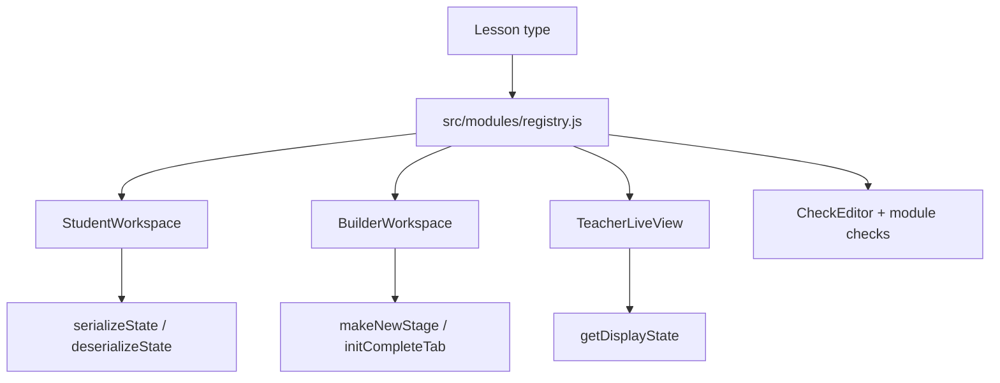

# Lesson Type Modules

Lesson types are intentionally isolated behind `src/modules/registry.js`. The classroom, teacher view, and builder should ask the registry for behavior instead of branching directly on every lesson type.

## Design Intent

The module boundary keeps new lesson types from spreading changes through `LessonTaskContent.jsx`, `TaskEditor.jsx`, and teacher live-view code. A type owns its state shape, editor surfaces, check editor, display-state selection, sandbox defaults, and optional runtime bridge.

Core app code may branch for broad task classes such as quiz or information tasks, but code lesson behavior should live in `src/modules/<type>/`.

## Contract

Each `src/modules/<type>/index.js` exports a default object. The complete inventory is mirrored in `docs/CODEBASE_MAP.md`; this page explains the intent behind the fields.

Each module is split in two (modular activities plan, step 1.1):

- `definition.js` is pure and Node-ESM-safe: no JSX, React, DOM access or runtimes (Pyodide, Blockly), and explicit `.js` extensions on every relative import. It holds `type`, `meta`, `capabilities`, the authoring, carry-through, state, sandbox and display hooks, and the capability flags, wrapped in `defineModule()` (`src/modules/defineModule.js`), which throws on a missing required field.
- `index.js` adds the UI half with `defineUiModule(definition, { StudentWorkspace, BuilderWorkspace, CheckEditor, FeedbackCheckEditor?, TeacherLiveView, getLayoutStyles, runtime })`. The merged object has the same shape the app consumed before the split.

`src/modules/definitions.js` collects every definition (`MODULE_TYPES`, `getModuleDefinition`) so the CLI, validation and shared type lists (`LESSON_MODULE_TYPES` in `src/shared/composedLesson.js`) can read module metadata under plain Node without importing React. `registry.js` takes its order and labels from it. `moduleDefinitionsNode.test.js` loads every definition in a real Node process to keep the split honest.

### Metadata and capabilities (plan step 1.2)

Core code no longer keeps its own module-type lists or label/icon maps; it derives them from the definitions with `getModuleTypesWhere`, `getModuleTypesWithCapability`, `CARRY_THROUGH_FIELDS` and `getModuleLabel(type, surface)` (all in `definitions.js`). A new module declares these once, and `defineModule` rejects a definition that omits one. `derivedTypeLists.test.js` pins the derived values.

`meta`:

- `label` — canonical name (registry, admin lists, playground title, Builder "Create a lesson" copy); `order` — registry order.
- `shortLabel`, `icon`, `pickerHint` — the Builder's composed-lesson module picker (`TaskEditor.jsx`).
- `language` — `'python' | 'html' | null`, the module's code language.
- `playground` — has a `/playground/:type` route (`PLAYGROUND_LESSON_TYPES`).
- `surfaceLabels` (optional) — per-surface wording that differs from `label`: `lessonIntro` (InformationTask Introduction slide), `builderMeta` (LessonMetaPanel), `print` (printLesson), `stageReference` (SupportStagePanel kicker).

`capabilities`:

- `sideExplainer` — explainer renders as a side rail (`LessonTaskContent.jsx`); otherwise an accordion above the workspace.
- `modulePanes` — `StudentWorkspace` reports `visiblePanes` through the generic `modulePanes` state.
- `teacherLiveReference` — teacher live code can be the support-stage reference (`TEACHER_LIVE_REFERENCE_TYPES`); membership alone is not enough, `teacherLiveReferenceDisplayState` must also adapt the payload.
- `unifiedStages` — remote reset uses the unified Starter/Complete stage selector (`buildStageOptions`).
- `sandboxState` — `'code' | 'blocks' | 'fs' | 'desktop' | 'files'`, where TeacherView keeps teacher sandbox work (`'code'` = the single code-string slot).

Top-level fields added alongside: `completeField` (the legacy non-stage Complete field, e.g. `completeCode`; an array field counts when non-empty) with `stageLabels` for stage options, and `explainerCodeBlockLanguages` (the explainer editor's code-block menu; empty = a generic block) next to `explainerInlineCodeLanguages`.

Required identity and surfaces:

- `type` matches the lesson `type` value.
- `StudentWorkspace` renders the student-facing task surface.
- `BuilderWorkspace` renders the builder task editor surface.
- `CheckEditor` renders the check configuration UI.
- `TeacherLiveView` renders the teacher-side live/sandbox view, or is `null` if the student workspace can be reused read-only.

State and display hooks:

- `initialState(task)` creates the student state for a task.
- `defaultState` is the fallback when no task-specific state exists.
- `serializeState(state)` and `deserializeState(raw)` protect localStorage and RTDB from type-specific state details.
- `getDisplayState(task, stage, liveState, tab)` chooses what teachers see for starter, stage, complete, sandbox, and live states.
- `getSandboxState(lesson, task)` creates the initial personal or teacher sandbox state.

Builder hooks:

- `makeCodeTaskFields(task)` creates type-specific fields when a task becomes a code task.
- `makeNewStage(task, existing)` creates a new stage state.
- `initCompleteTab(task, ctx)` and `initStageTab(stage, ctx)` lazily populate builder tabs.
- `getCarryThroughUpdates(sourceTask)` and `getNewStarterUpdates(task)` keep carry-through logic type-owned.

Validation hooks (pure; shared by the Builder and the CLI through `src/shared/lessonValidation.js`):

- `validateTask(task, { n, lesson, errors, warnings })` pushes the module's own rules (check fields, starter state, stages, complete-solution warnings). It runs for code tasks and for `code_arrange` tasks hosted by the module, looked up by the task's effective module type.
- `hasStarterContent(task)` (optional; `null` = no empty-editor warning), `hasCheckValue(task)` (optional; the Builder's untested-check reminder) and `validateTaskInBrowser(task, ctx)` (optional; Builder-only rules that need browser APIs).

Capability flags:

- `supportsInteractionMode` controls Run/Submit mode UI.
- `supportsIncorrectChecks` controls feedback-check UI.
- `supportsTests` and `supportsVariableChecks` control Python-style test/variable checks.
- `supportsDomChecks` controls HTML element checks.
- `runtime` exposes optional async execution helpers such as Pyodide or MicroPython.

## Runtime Flow

```mermaid
flowchart TD
  Lesson["Lesson type"] --> Registry["src/modules/registry.js"]
  Registry --> Student["StudentWorkspace"]
  Registry --> Builder["BuilderWorkspace"]
  Registry --> Teacher["TeacherLiveView"]
  Registry --> Checks["CheckEditor + module checks"]
  Student --> Persist["serializeState / deserializeState"]
  Teacher --> Display["getDisplayState"]
  Builder --> Stages["makeNewStage / initCompleteTab"]
```

## Check-Type Registry

Check evaluation is registry-driven. `src/modules/checkRegistry.js` (pure, Node-safe) exports `createCheckRegistry(defs)`; `src/modules/checks.js` builds one `checkRegistry` from `CORE_CHECKS` plus each module's exported `CHECKS` array (`filesystem`, `desktop`, `python`, `html`, `electronics`, `turtle`). A definition is:

`{ type, owner, subject?, operators?, fields?, aliases?, timing, requiresRun, submitAllowed, contextKey?, evaluate(check, output, ctx), validate?(check, ctx) }`

- `owner` is `core`, `module:<type>`, and later `activity:<id>` or `input`. Every canonical type and alias has exactly one owner; registering a duplicate id throws.
- `aliases` are legacy ids that resolve to the definition (`output_contains` → `output`, `element_value_equals` → `html_element_value`, `fs_content_contains` → `fs_file_content`). Core aliases are rewritten by `normalizeCheckShape` before lookup; module evaluators normalise their own aliases.
- `evaluateSingleCheck` normalises core aliases, looks the type up, and calls `evaluate`; unknown types return `false`. The electronics override (a generic `code` check reads the Micro Controller's MicroPython source when `ctx.circuit` is set) lives in the core `code` definition.
- `CHECK_TYPES.RUN_REQUIRED` and `SUBMIT_ALLOWED` (used by `checkRequiresRun` / `checkAllowedForSubmit`, the Builder and the CLI) are derived from `requiresRun` / `submitAllowed`, including aliases.
- Scratch checks are not registered: they are evaluated inside the Scratch workspace by `evaluateScratchCheck`.
- `validate` is reserved for per-type authoring validation (still in `src/shared/checkAuthoringValidation.js`); Builder check editors do not yet render from `fields`.

To add a check type, add a definition to the owning module's `CHECKS`. `src/modules/__tests__/checkRegistryParity.test.js` asserts ownership and parity with the frozen pre-registry dispatcher (`legacyCheckDispatcher.js`).

## Usually Changes With

When this contract changes, also check:

- `src/modules/__tests__/moduleInterface.test.js`
- `src/app/components/LessonTaskContent.jsx`
- `src/app/views/teacher/TeacherEditorPanel.jsx`
- `src/builder/components/TaskEditor.jsx`
- `src/builder/components/task-editor/TaskOptionsSection.jsx`
- `docs/architecture/feature-impact-map.md`
- `docs/authoring/<type>.md`
- `docs/CODEBASE_MAP.md`
- `docs/TESTING.md`

## Adding A New Type

1. Add `src/modules/<type>/definition.js`, `index.js`, `StudentWorkspace.jsx`, `BuilderWorkspace.jsx`, and `CheckEditor.jsx`.
2. Add type-specific `checks.js` if the type needs custom checks, exporting `CHECKS` definitions and adding them to `checkRegistry` in `src/modules/checks.js`.
3. Register the definition in `src/modules/definitions.js` and the module in `src/modules/registry.js`.
4. Add authoring documentation and examples.
5. Add module contract tests and focused behavior tests.
6. Update `docs/CODEBASE_MAP.md`, `docs/FEATURES.md`, and this page if the contract changes.

