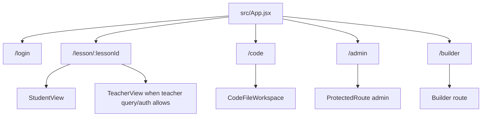
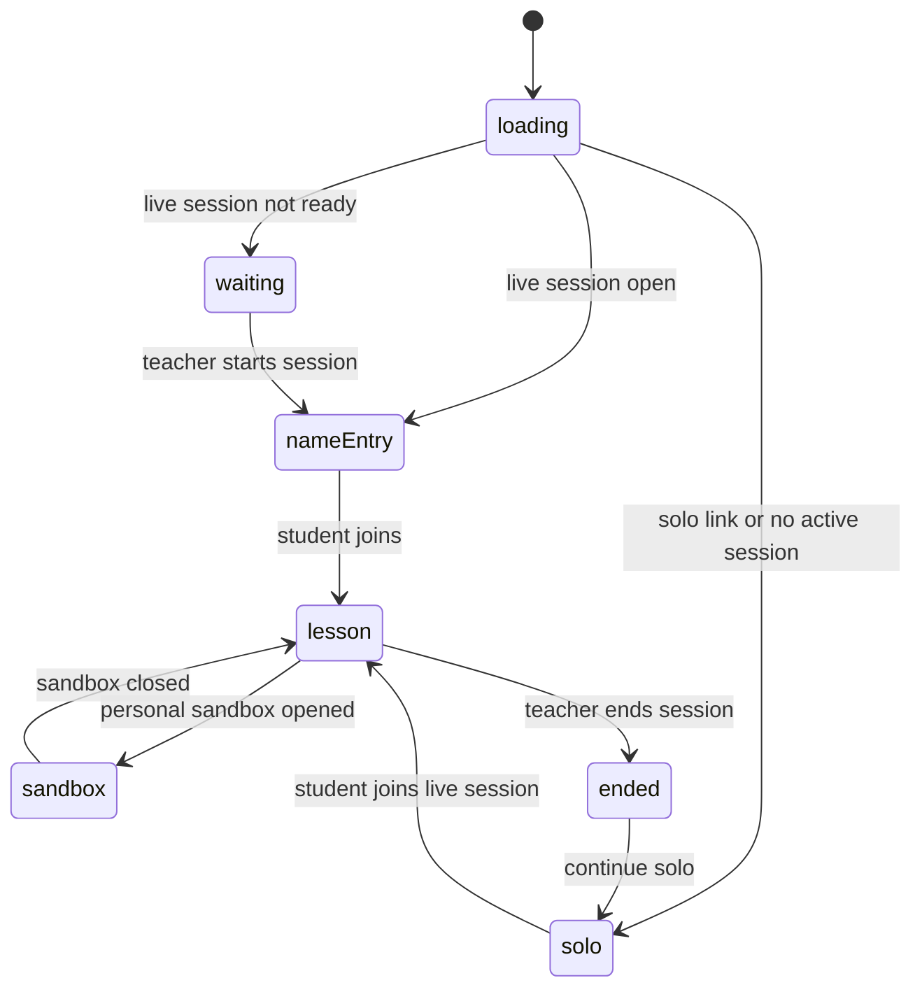
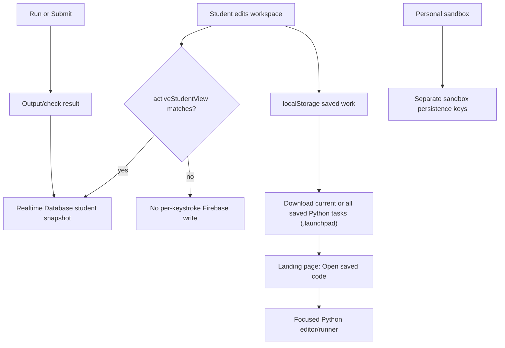
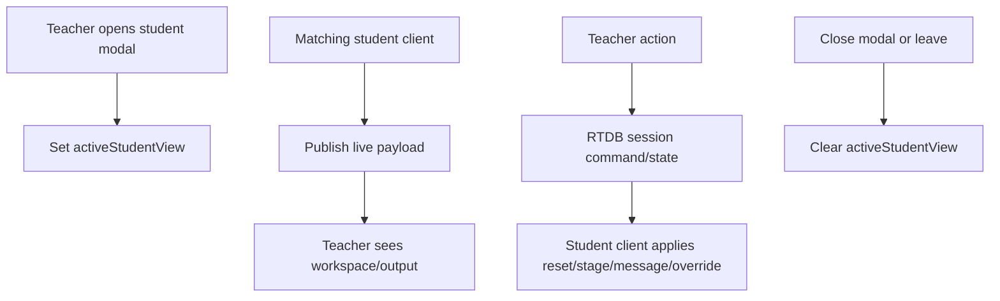
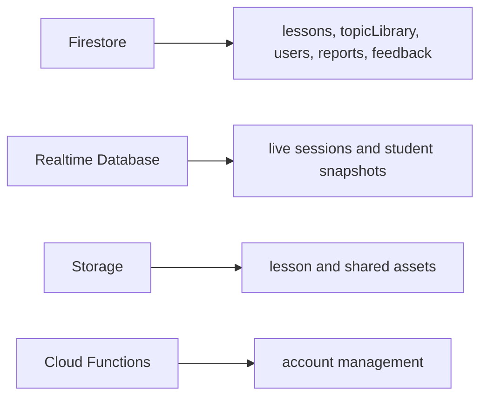

# Runtime Flows

This page captures the design intent behind the classroom runtime. Use the deeper agent references for exact field names and security details:

- `docs/agents/runtime-model.md`
- `docs/agents/classroom-behaviours.md`
- `docs/architecture/feature-impact-map.md`

## Route Ownership

The app stays frontend-only. Firebase supplies auth, durable lesson/admin data, live session data, storage, and account-management functions.

## Student Phase State

`useStudentPhase.js` owns the phase and current/viewing task decisions. Student identity remains login-less and is stored in localStorage.

## Student Persistence

The important invariant is that normal student code is local-first. Firebase streaming is reserved for teacher live-view moments and explicit run/check events.

## Teacher Live View

All ways of closing the modal should clear `activeStudentView`. This prevents accidental long-running student code streaming.

## Firebase Ownership

When any path, write owner, or security assumption changes, update `docs/agents/runtime-model.md`, the relevant Firebase rules, and the feature impact map.

